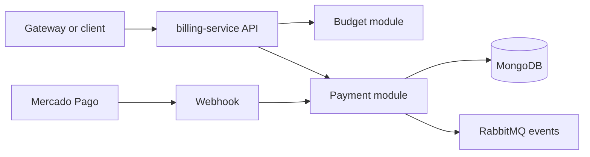

# Billing Service

`billing-service` owns budgets, payments, Mercado Pago integration, webhook
processing and payment refunds.

## Responsibility

- budget creation, approval and rejection
- Checkout Pro payment creation
- payment status persistence
- Mercado Pago webhook processing
- refund orchestration on billing side
- MongoDB-owned persistence only

This service does not access the databases of `customer-service`, `os-service`
or `workshop-service`. It does not persist card data.

## Technology

- NestJS
- MongoDB
- Mongoose
- RabbitMQ messaging
- Swagger
- Mercado Pago Checkout Pro
- Prometheus `/metrics`
- JSON logs with `correlationId`
- Dockerfile and Docker Compose
- Kubernetes manifests
- Sonar configuration

## Architecture



## Data Ownership

- owned database: MongoDB
- owned collections: budgets, payments, payment_webhooks, consumed message ledger
- no cross-service database access
- no payment card persistence

## Main API Groups

Swagger is the reference for the full contract:

- local Swagger URL: `http://localhost:3000/docs`
- route groups:
  - `budgets`
  - `payments`
  - `payment-webhooks`
  - `platform`

## Published Events

- `budget.created`
- `budget.approved`
- `budget.rejected`
- `payment.created`
- `payment.approved`
- `payment.failed`
- `payment.refunded`
- `payment.refund.failed`

## Consumed Events

- `budget.requested`
- `payment.refund.requested`

## Mercado Pago

- Checkout Pro is the implemented payment flow
- credentials are separated by environment through:
  - `MERCADO_PAGO_ENVIRONMENT=test`
  - `MERCADO_PAGO_ENVIRONMENT=production`
- the webhook endpoint is `POST /webhooks/mercado-pago`
- refunds are total refunds only
- no real Mercado Pago call is made by local automated tests

## Environment Variables

See `.env.example` for the safe local template.

Key variables:

- `MONGODB_URI`
- `JWT_SECRET`
- `JWT_ISSUER`
- `JWT_AUDIENCE`
- `MESSAGING_ENABLED`
- `PAYMENT_REFUND_LEASE_MS`
- `MERCADO_PAGO_ENVIRONMENT`
- `MERCADO_PAGO_TEST_ACCESS_TOKEN`
- `MERCADO_PAGO_PRODUCTION_ACCESS_TOKEN`
- `MERCADO_PAGO_TEST_WEBHOOK_SECRET`
- `MERCADO_PAGO_PRODUCTION_WEBHOOK_SECRET`
- `MERCADO_PAGO_NOTIFICATION_URL`
- `MERCADO_PAGO_SUCCESS_URL`
- `MERCADO_PAGO_FAILURE_URL`
- `MERCADO_PAGO_PENDING_URL`

Do not commit real secrets.

## Local Execution

```bash
npm ci
npm run start:dev
```

Local supporting assets:

- `Dockerfile`
- `docker-compose.yml`

## Tests And Validation

```bash
npm run format
npm run lint
npm run build
npm test -- --runInBand
npm run test:cov
docker compose --env-file .env.example config
kubectl kustomize k8s
```

Jest enforces `80%` minimum for statements, branches, functions and lines.

## CI/CD

Workflow files:

- `.github/workflows/ci.yml`
- `.github/workflows/cd.yml`

CI validates lint, build, coverage, Docker build, Kubernetes render and Sonar.

CD is configured for:

- `homologation` -> GitHub Environment `homologation`
- `main` -> GitHub Environment `production`

This README documents pipeline configuration only. It does not claim a hosted
deployment was executed from this workspace.

## Kubernetes

This repository contains service-local manifests under `k8s/`:

- `Deployment`
- `Service`
- `ConfigMap`
- `Secret` template
- `HorizontalPodAutoscaler`

Local render:

```bash
kubectl kustomize k8s
```

## Observability

- `/metrics`
- JSON logs
- readiness `/ready`
- liveness `/health`
- provider and broker integration failure metrics

## External Dependencies

- MongoDB
- RabbitMQ
- Mercado Pago
- JWT issued by `auth-function`

## Delivery Evidence

- repository URL: `PENDING`
- homologation URL: `PENDING`
- latest successful CI run: `PENDING`
- quality gate: `PENDING`
- coverage evidence: `98.33% statements, 85.92% branches, 96.58% functions, 98.4% lines (local artifact); hosted link/print PENDING`
- branch protection: `PENDING VERIFICATION`
- Swagger hosted URL: `PENDING`

## External Evidence Status

- hosted repository and Swagger URLs: `PENDING`
- branch protection and environments: `PENDING VERIFICATION`
- no deploy was executed from this workspace
